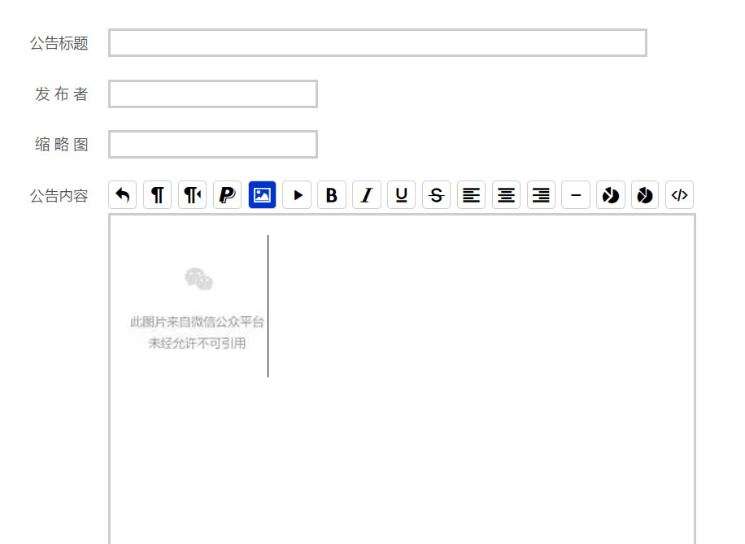

"# wechat-editor" 

###简易微网页内容编辑器
- 只有一个js文件
- 按钮图标引用的是 bootmetro-icons.min.css，也可自己使用图片或其它图标
- 插入章标题
- 插入节标题
- 剔除所有div及杂项html代码
- 图片支持直接添加至微信api的永久素材中

###使用方式
- 直接在html中<script src="edit.js"></script>
- 然后写代码
```javascript
    var we = weEdit;
    we.id = '#edit'; // 编辑器放置节点，可以是class或者id
    we.buttons: [
        'undo', 'h2', 'h3', 'p', 'img', 'vod', 'b', 'i', 'u', 's', 'l', 'c', 'r', 'h', 'color', 'bgcolor', 'code'
    ]; //要使用的按钮
    we.init();

    // 上传成功回调，请将当前网站域名添加至微信后台的授权域名里，否则无法显示出图片
    function success(fs, url) {
        if (url == '') {
            alert('上传失败！');
            we.exec('undo');
        } else {
            we.doc.getElementById('file' + fs).src = url;
            we.setDate();
        }
    }
```
  
   
